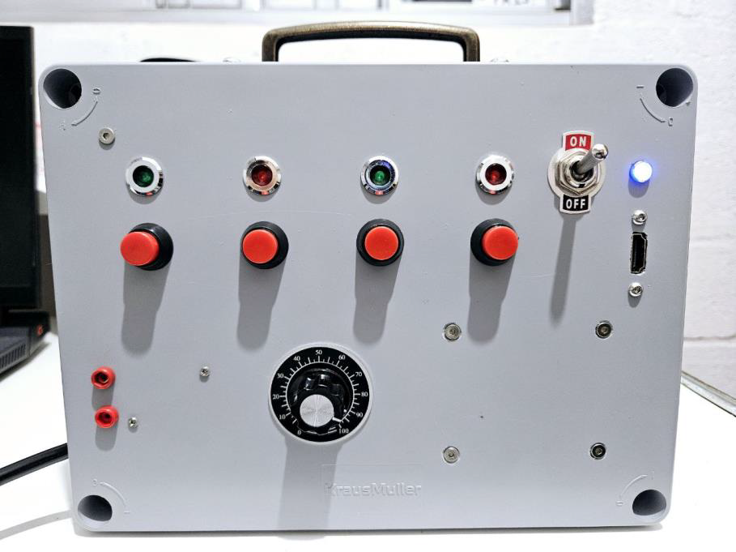

# Codebox
Codebox is a Codesys implementation in a raspberry board

A CodeBox ou CodeRPIBox é uma jiga de teste multiprotocolo que utiliza o Software Codesys embarcado em uma placa Raspberry PI 3. Ela pode ser utilizada como escravo Modbus TCP, escravo Ethernet/IP, escravo Profinet IO ou mestre/escravo OPC-UA. A figura abaixo mostra uma imagem do CodeBox

The CodeBox or CodeRPIBox is a multiprotocol test kit that uses Codesys software embedded on a Raspberry Pi 3 Model B board. It can be used as a Modbus TCP slave, Ethernet/IP slave, Profinet IO slave, or OPC-UA master/slave. The figure below shows a screenshot of the CodeBox.
To communicate the CodeBox on the network, simply connect a network cable to a DHCP network or configure the IP locally.

In the folder, there is a pdf file that explain in details our implementation and how to use in the codesys.

